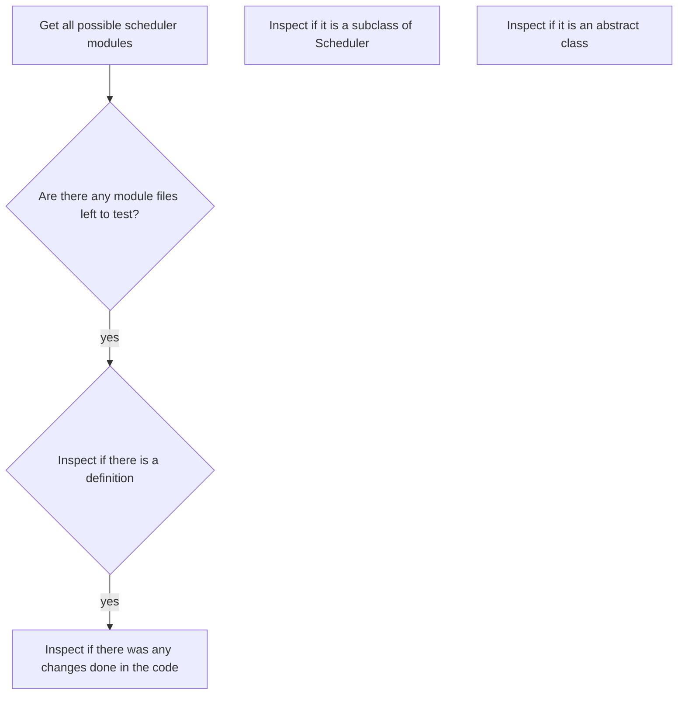

# Schedulers

```mermaid

graph
    getModules[Get all possible scheduler modules]
    forEachModule{Are there any module files left to test?}
    inspectModule{Inspect if there is a definition}
    inspectModuleCodeChange[Inspect if there was any changes done in the code]
    inspectModuleSubclass[Inspect if it is a subclass of Scheduler]
    inspectModuleAbstract[Inspect if it is an abstract class]

    getModules --> forEachModule
    forEachModule -- yes --> inspectModule
    inspectModule -- yes --> inspectModuleCodeChange

```
