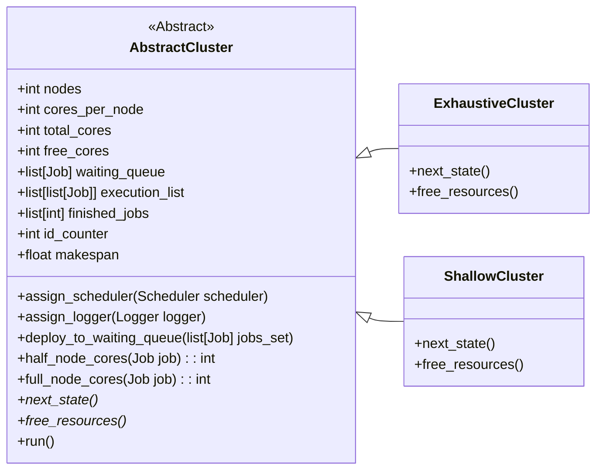

# Cluster

A class to describe a cluster to run the simulation on. For a cluster to work
three things need to be provided. A set of jobs, a scheduler and a logger to
record events.

## User Guide

There are two classes that a user can use in order to run a simulation. These
are:
- **ExhaustiveCluster**
- **ShallowCluster**

In order to use them the number of nodes and cores per node should be defined
when initializing them. Afterwards we provide sequentially the three things we
need to provide.

```python
from realsim.cluster.exhaustive import ExhaustiveCluster
from realsim.cluster.shallow import ShallowCluster

# Initializing clusters
cluster1 = ExhaustiveCluster(426, 20)
cluster2 = ShallowCluster(200, 10)

# Provide a jobs set
# This is usually done by a generator
cluster1.deploy_to_waiting_queue(jobs_set1)

# Provide a scheduler
cluster1.assign_scheduler(scheduler1)

# Provide a logger
cluster1.assign_logger(logger1)

# The cluster is now ready to run a simulation
cluster1.run()
```


## Developer Guide

If someone wants to build a new cluster and still be compatible with the other
components of the simulation, an abstract class called **AbstractCluster** is
provided, that has implemented the most basic functions needed for a cluster and
that works as a blueprint. The following diagram shows how the two concrete
classes discussed in User Guide inherit from AbstractCluster.



Only next_state() and free_resources() are marked as abstract and need to be
implemented by new cluster class.
